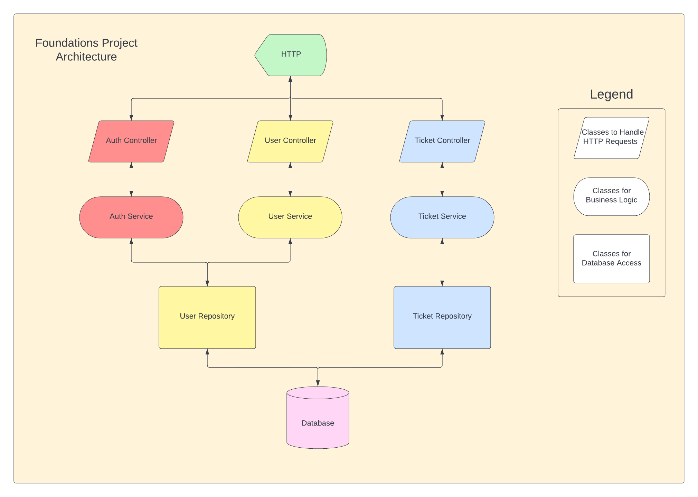

# Project Description
This project is an Expense Management System with the purpose of managing Reimbursement requests from employees from a general company.
There are two possible types of users for this system; Employees and Managers. Each can do separate actions and see different scopes of information. All users can reset their password, login, and register from the home screen of the application

